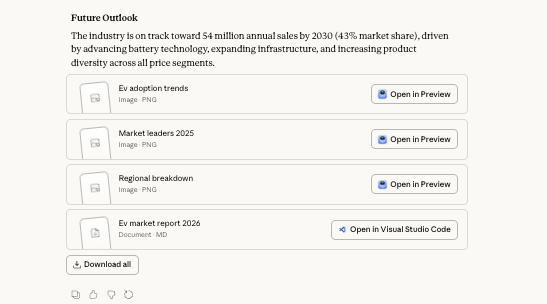

# MCP-Powered AI Research Engineer

Turn a single prompt into a full research report (web + your notes + code + charts).

[](https://opensource.org/licenses/MIT)
[](https://www.python.org/downloads/)
[](https://modelcontextprotocol.io/)
<br>
[](https://github.com/prabureddy/ai-research-agent-mcp/pulls)
[](https://youtu.be/_cQLKpfDTBY)
<br>
[](https://github.com/prabureddy/ai-research-agent-mcp)

An autonomous AI agent that researches, codes, and writes comprehensive reports using the Model Context Protocol (MCP).

## ⚡ One‑liner install

### Option 1: Using uv (Recommended - Fast!)
```bash
git clone https://github.com/prabureddy/ai-research-agent-mcp.git \
  && cd ai-research-agent-mcp/server \
  && uv venv \
  && source .venv/bin/activate \
  && uv pip install -r requirements.txt
```

### Option 2: Using pip (Traditional)
```bash
git clone https://github.com/prabureddy/ai-research-agent-mcp.git \
  && cd ai-research-agent-mcp/server \
  && python3 -m venv venv \
  && source venv/bin/activate \
  && pip3 install -r requirements.txt
```

> **⚡ Quick Start:** Clone → Install → Configure Claude Desktop → Start researching in 5 minutes!

---

## 📸 See It In Action


📺 **[Watch the full video demo on YouTube](https://youtu.be/_cQLKpfDTBY)**



**Example Task → Output:**
```
"Research top 3 programming languages in 2026 and create a comparison chart"

→ research_runs/2026-02-07_143022_programming-languages/
  ├── report.md              # Full analysis with sources
  ├── comparison_chart.png   # Visual comparison
  ├── data.json             # Raw statistics
  └── code/analysis.py      # Generated code
```

**What the agent does:** Searches web → Writes code → Creates charts → Generates report → Self-evaluates (all in ~60 seconds)

---

## Who is this for?

- AI engineers doing research
- Indie hackers prototyping ideas
- Knowledge workers who live in Claude Desktop or Cursor

## Overview

This system enables you to give a single command like:
> "Compare electric scooters vs bikes for my commute and prototype a savings calculator"

And the agent autonomously:
- 🔍 Researches the web for relevant data
- 📚 Queries your personal knowledge base (notes, papers, docs)
- 💻 Writes and executes code (models, simulations, visualizations)
- 📊 Generates comprehensive reports with charts and analysis
- 🎯 Self-evaluates and logs quality metrics

---

## Table of Contents

- [Features](#features)
- [Quick Start](#quick-start)
- [Architecture](#architecture)
- [Configuration](#configuration)
- [Usage](#usage)
- [Project Structure](#project-structure)
- [Troubleshooting](#troubleshooting)
- [Example Output](#example-output)
- [Development](#development)
- [Uninstallation](#uninstallation)
- [Contributing](#contributing)
- [License](#license)

---

## Features

- ✅ Autonomous multi-step research
- ✅ Web search and content extraction
- ✅ RAG over personal knowledge base
- ✅ Safe code execution with output capture
- ✅ Structured report generation
- ✅ Self-evaluation and quality metrics
- ✅ Comprehensive logging and tracing
- ✅ Reproducible research runs

---

## Quick Start

Get up and running in 5 minutes.

### Prerequisites

- **Python 3.10 or higher** (Python 3.11+ recommended)
- **Claude Desktop** or **Cursor IDE** (MCP-compatible client)
- **Git** (for cloning the repository)
- **uv** (optional but recommended - [install here](https://github.com/astral-sh/uv)) or **pip**
- (Optional) API keys for enhanced features

### Installation Steps

#### 1. Clone the Repository

```bash
git clone https://github.com/prabureddy/ai-research-agent-mcp.git
cd ai-research-agent-mcp
```

#### 2. Install Dependencies

**Option A: Using uv (Recommended - 10-100x faster!)**
```bash
# Navigate to server directory
cd server

# Install uv if you haven't already
# macOS/Linux:
curl -LsSf https://astral.sh/uv/install.sh | sh
# Windows:
# powershell -c "irm https://astral.sh/uv/install.ps1 | iex"

# Create and activate virtual environment
uv venv
source .venv/bin/activate  # Windows: .venv\Scripts\activate

# Install required packages (much faster than pip!)
uv pip install -r requirements.txt
```

**Option B: Using pip (Traditional)**
```bash
# Navigate to server directory
cd server

# Create and activate virtual environment
python3.11 -m venv venv
source venv/bin/activate  # Windows: venv\Scripts\activate

# Install required packages
pip install -r requirements.txt
```

#### 3. Configure Environment

```bash
# Return to project root
cd ..

# Copy example environment file
cp .env.example .env

# Edit .env with your preferred text editor (optional)
nano .env  # or vim, code, etc.
```

**Environment Configuration (Optional):**
```bash
# Optional: For Brave Search (better than DuckDuckGo)
BRAVE_API_KEY=your_brave_api_key_here

# Optional: For future Anthropic integrations
ANTHROPIC_API_KEY=your_anthropic_api_key_here

# Optional: Customize paths
RESEARCH_RUNS_DIR=./research_runs
KNOWLEDGE_BASE_DIR=./knowledge_base

# RAG uses local embeddings by default (no API key needed!)
USE_LOCAL_EMBEDDINGS=true
EMBEDDING_MODEL=all-MiniLM-L6-v2
```

**⚠️ Important:** Never commit your `.env` file to version control. It's already included in `.gitignore`.

**Note:** The system uses local sentence-transformers embeddings by default, so no API keys are required for RAG features!

#### 4. Create Required Directories

```bash
# Create directories for data storage
mkdir -p research_runs knowledge_base data/vector_db logs
```

#### 5. Configure Claude Desktop

**macOS:** Edit `~/Library/Application Support/Claude/claude_desktop_config.json`

**Windows:** Edit `%APPDATA%\Claude\claude_desktop_config.json`

**Linux:** Edit `~/.config/Claude/claude_desktop_config.json`

**Find your absolute paths first:**
```bash
# In your project directory, run:
pwd
# Example output: /Users/yourname/Projects/ai-research-agent-mcp

# Find your Python path (if using venv):
which python  # or: which python3.11
# Example output: /Users/yourname/Projects/ai-research-agent-mcp/server/venv/bin/python3.11
```

**Configuration Template:**

Add the following configuration, replacing the paths and environment variables with your actual values:

```json
{
  "mcpServers": {
    "research-engineer": {
      "command": "/absolute/path/to/python",
      "args": [
        "/absolute/path/to/ai-research-agent-mcp/server/src/server.py"
      ],
      "env": {
        "BRAVE_API_KEY": "your_brave_api_key_here_or_remove_this_line",
        "ANTHROPIC_API_KEY": "your_anthropic_api_key_here_or_remove_this_line",
        "SEARCH_PROVIDER": "duckduckgo",
        "MAX_SEARCH_RESULTS": "10",
        "EMBEDDING_MODEL": "all-MiniLM-L6-v2",
        "USE_LOCAL_EMBEDDINGS": "true",
        "VECTOR_DB_PATH": "/absolute/path/to/ai-research-agent-mcp/data/vector_db",
        "CHUNK_SIZE": "1000",
        "CHUNK_OVERLAP": "200",
        "SANDBOX_TIMEOUT": "30",
        "SANDBOX_MAX_MEMORY_MB": "512",
        "ALLOWED_PACKAGES": "numpy,pandas,matplotlib,seaborn,scipy,scikit-learn",
        "RESEARCH_RUNS_DIR": "/absolute/path/to/ai-research-agent-mcp/research_runs",
        "KNOWLEDGE_BASE_DIR": "/absolute/path/to/ai-research-agent-mcp/knowledge_base",
        "LOG_LEVEL": "INFO",
        "LOG_FILE": "/absolute/path/to/ai-research-agent-mcp/logs/research_engineer.log"
      }
    }
  }
}
```

**⚠️ Important Notes:**
- Use **absolute paths** for all file paths (no `~` or relative paths)
- If using a virtual environment, use the Python path from inside the venv
- Remove or leave empty any API keys you don't have (DuckDuckGo works without keys)
- All paths in `env` must be absolute paths

**Example for macOS/Linux (with venv):**
```json
{
  "mcpServers": {
    "research-engineer": {
      "command": "/Users/yourname/Projects/ai-research-agent-mcp/server/venv/bin/python3.11",
      "args": [
        "/Users/yourname/Projects/ai-research-agent-mcp/server/src/server.py"
      ],
      "env": {
        "SEARCH_PROVIDER": "duckduckgo",
        "MAX_SEARCH_RESULTS": "10",
        "USE_LOCAL_EMBEDDINGS": "true",
        "EMBEDDING_MODEL": "all-MiniLM-L6-v2",
        "VECTOR_DB_PATH": "/Users/yourname/Projects/ai-research-agent-mcp/data/vector_db",
        "RESEARCH_RUNS_DIR": "/Users/yourname/Projects/ai-research-agent-mcp/research_runs",
        "KNOWLEDGE_BASE_DIR": "/Users/yourname/Projects/ai-research-agent-mcp/knowledge_base",
        "LOG_FILE": "/Users/yourname/Projects/ai-research-agent-mcp/logs/research_engineer.log"
      }
    }
  }
}
```

**Example for macOS/Linux (with uv):**
```json
{
  "mcpServers": {
    "research-engineer": {
      "command": "uv",
      "args": [
        "run",
        "--directory",
        "/Users/yourname/Projects/ai-research-agent-mcp/server",
        "python",
        "src/server.py"
      ],
      "env": {
        "SEARCH_PROVIDER": "duckduckgo",
        "MAX_SEARCH_RESULTS": "10",
        "USE_LOCAL_EMBEDDINGS": "true",
        "EMBEDDING_MODEL": "all-MiniLM-L6-v2",
        "VECTOR_DB_PATH": "/Users/yourname/Projects/ai-research-agent-mcp/data/vector_db",
        "RESEARCH_RUNS_DIR": "/Users/yourname/Projects/ai-research-agent-mcp/research_runs",
        "KNOWLEDGE_BASE_DIR": "/Users/yourname/Projects/ai-research-agent-mcp/knowledge_base",
        "LOG_FILE": "/Users/yourname/Projects/ai-research-agent-mcp/logs/research_engineer.log"
      }
    }
  }
}
```

**Example for Windows:**
```json
{
  "mcpServers": {
    "research-engineer": {
      "command": "C:/Users/yourname/Projects/ai-research-agent-mcp/server/venv/Scripts/python.exe",
      "args": [
        "C:/Users/yourname/Projects/ai-research-agent-mcp/server/src/server.py"
      ],
      "env": {
        "SEARCH_PROVIDER": "duckduckgo",
        "MAX_SEARCH_RESULTS": "10",
        "USE_LOCAL_EMBEDDINGS": "true",
        "EMBEDDING_MODEL": "all-MiniLM-L6-v2",
        "VECTOR_DB_PATH": "C:/Users/yourname/Projects/ai-research-agent-mcp/data/vector_db",
        "RESEARCH_RUNS_DIR": "C:/Users/yourname/Projects/ai-research-agent-mcp/research_runs",
        "KNOWLEDGE_BASE_DIR": "C:/Users/yourname/Projects/ai-research-agent-mcp/knowledge_base",
        "LOG_FILE": "C:/Users/yourname/Projects/ai-research-agent-mcp/logs/research_engineer.log"
      }
    }
  }
}
```

#### 6. Restart Claude Desktop

Completely quit and restart Claude Desktop for changes to take effect.

### Verify Installation

In Claude Desktop, type:
```
List available tools
```

You should see: `web_search`, `web_research`, `execute_code`, `create_research_run`, etc.

### Your First Research Task

Try this simple task:

```
Research the current state of electric vehicles in 2026. 
Include market size, major players, and growth trends. 
Create a simple visualization showing EV adoption over time.
```

The agent will:
1. Search the web for EV data
2. Write Python code to create a chart
3. Present findings with sources

---

## Architecture

### System Overview

```
┌─────────────────────────────────────────────────────────────┐
│                    Claude Desktop / Cursor                   │
│                     (MCP Client/Host)                        │
└────────────────────────┬────────────────────────────────────┘
                         │ MCP Protocol (stdio)
                         │
┌────────────────────────▼────────────────────────────────────┐
│                    MCP Server (Python)                       │
│  ┌──────────────────────────────────────────────────────┐  │
│  │              Tool Registry & Router                   │  │
│  └──────────────────────────────────────────────────────┘  │
│                                                              │
│  ┌──────────────┐  ┌──────────────┐  ┌──────────────┐     │
│  │ Web Research │  │   RAG Tool   │  │Code Sandbox  │     │
│  │              │  │              │  │              │     │
│  │ • Search     │  │ • Embeddings │  │ • Restricted │     │
│  │ • Scrape     │  │ • ChromaDB   │  │   Python     │     │
│  │ • Extract    │  │ • Query      │  │ • Safe Exec  │     │
│  └──────────────┘  └──────────────┘  └──────────────┘     │
│                                                              │
│  ┌──────────────┐  ┌──────────────┐                        │
│  │  Workspace   │  │  Evaluator   │                        │
│  │              │  │              │                        │
│  │ • File I/O   │  │ • Metrics    │                        │
│  │ • Organize   │  │ • Critique   │                        │
│  │ • Manage     │  │ • Quality    │                        │
│  └──────────────┘  └──────────────┘                        │
└─────────────────────────────────────────────────────────────┘
                         │
                         ▼
        ┌────────────────────────────────────┐
        │      External Services              │
        │                                     │
        │  • DuckDuckGo / Brave Search       │
        │  • OpenAI Embeddings API           │
        │  • Web Scraping (HTTP)             │
        └────────────────────────────────────┘
                         │
                         ▼
        ┌────────────────────────────────────┐
        │      Local Storage                  │
        │                                     │
        │  • research_runs/                  │
        │  • knowledge_base/                 │
        │  • data/vector_db/                 │
        │  • logs/                           │
        └────────────────────────────────────┘
```

### Core Components

#### 1. MCP Server ([`server/src/server.py`](server/src/server.py))

**Responsibilities:**
- Expose tools via MCP protocol
- Route tool calls to appropriate handlers
- Handle errors and logging
- Manage server lifecycle

**Technology:**
- Python 3.10+
- MCP SDK (`mcp` package)
- Async/await for I/O operations

#### 2. Web Research Tool ([`server/src/tools/web_research.py`](server/src/tools/web_research.py))

**Responsibilities:**
- Search the web for information
- Scrape and extract clean content
- Handle rate limiting and retries

**Components:**
- **Search Providers:** DuckDuckGo (default, no API key), Brave Search (optional)
- **Content Extraction:** Trafilatura for main content, BeautifulSoup for metadata

#### 3. RAG Tool ([`server/src/tools/rag_tool.py`](server/src/tools/rag_tool.py))

**Responsibilities:**
- Index documents into vector database
- Semantic search over knowledge base
- Support multiple file formats (Markdown, PDF, DOCX)

**Components:**
- **Vector Database:** ChromaDB (persistent, local)
- **Embeddings:** OpenAI `text-embedding-3-small`
- Chunking strategy: 1000 chars with 200 char overlap

#### 4. Code Sandbox ([`server/src/tools/code_sandbox.py`](server/src/tools/code_sandbox.py))

**Responsibilities:**
- Execute Python code safely
- Capture output and plots
- Enforce resource limits

**Security Layers:**
1. RestrictedPython: AST-level code restrictions
2. Resource Limits: Memory and CPU constraints
3. Timeout: Execution time limits
4. Allowed Packages: Whitelist of safe libraries (numpy, pandas, matplotlib, etc.)

#### 5. Workspace Tool ([`server/src/tools/workspace.py`](server/src/tools/workspace.py))

**Responsibilities:**
- Organize research outputs
- Manage file I/O
- Track research runs

**Directory Structure:**
```
research_runs/
└── YYYY-MM-DD_HHMMSS_task-name/
    ├── metadata.json
    ├── report.md
    ├── evaluation.json
    ├── sources.json
    ├── code/
    │   └── *.py
    ├── charts/
    │   └── *.png
    └── data/
        └── *.json
```

#### 6. Evaluator Tool ([`server/src/tools/evaluator.py`](server/src/tools/evaluator.py))

**Responsibilities:**
- Quality assessment
- Self-critique generation
- Metrics tracking

**Quality Metrics (0-10 scale):**
- Clarity, Data Grounding, Completeness, Code Quality, Actionability, Confidence

---

## Configuration

### Environment Variables

See `.env.example` for all available configuration options:

```bash
# Search Configuration
BRAVE_API_KEY=...           # Optional: Better search than DuckDuckGo
SEARCH_PROVIDER=duckduckgo  # duckduckgo or brave
MAX_SEARCH_RESULTS=10

# RAG Configuration (uses local embeddings by default)
USE_LOCAL_EMBEDDINGS=true
EMBEDDING_MODEL=all-MiniLM-L6-v2
VECTOR_DB_PATH=./data/vector_db
CHUNK_SIZE=1000
CHUNK_OVERLAP=200

# Code Sandbox Configuration
SANDBOX_TIMEOUT=30
SANDBOX_MAX_MEMORY_MB=512

# Directory Configuration
RESEARCH_RUNS_DIR=./research_runs
KNOWLEDGE_BASE_DIR=./knowledge_base

# Logging
LOG_LEVEL=INFO
```

### Cursor IDE Configuration (Alternative)

#### 1. Open Cursor Settings

Press `Cmd+,` (Mac) or `Ctrl+,` (Windows/Linux)

#### 2. Search for "MCP"

Find the MCP Servers configuration section.

#### 3. Add Server Configuration

Add the same configuration as Claude Desktop (see section 5 above for detailed examples).

**Basic Example:**
```json
{
  "research-engineer": {
    "command": "/absolute/path/to/python",
    "args": [
      "/absolute/path/to/ai-research-agent-mcp/server/src/server.py"
    ],
    "env": {
      "SEARCH_PROVIDER": "duckduckgo",
      "USE_LOCAL_EMBEDDINGS": "true",
      "VECTOR_DB_PATH": "/absolute/path/to/data/vector_db",
      "RESEARCH_RUNS_DIR": "/absolute/path/to/research_runs",
      "KNOWLEDGE_BASE_DIR": "/absolute/path/to/knowledge_base"
    }
  }
}
```

**Using uv:**
```json
{
  "research-engineer": {
    "command": "uv",
    "args": [
      "run",
      "--directory",
      "/absolute/path/to/ai-research-agent-mcp/server",
      "python",
      "src/server.py"
    ],
    "env": {
      "SEARCH_PROVIDER": "duckduckgo",
      "USE_LOCAL_EMBEDDINGS": "true"
    }
  }
}
```

---

## Usage

### Basic Research Task

#### Simple Query

```
Research the pros and cons of electric scooters vs bikes for urban commuting.
```

The agent will:
1. Search the web for relevant information
2. Organize findings
3. Present a summary

#### Comprehensive Research with Code

```
Deep dive: Compare electric scooters vs bikes for my 5-mile daily commute. 
Build a cost calculator in Python that shows total cost of ownership over 3 years.
Include purchase price, maintenance, electricity/none, and create visualizations.
```

The agent will:
1. Research costs, maintenance, and usage data
2. Build a Python cost calculator
3. Create comparison charts
4. Write a comprehensive report
5. Save everything to a research run directory
6. Self-evaluate the work

### Tool Usage Examples

#### Web Research

**Search only:**
```
Use web_search to find the latest news about AI regulation in 2026
```

**Comprehensive research with scraping:**
```
Use web_research to gather detailed information about multifamily real estate cap rates, 
and scrape the top 5 results for full content
```

**Scrape specific URL:**
```
Scrape this article and summarize the key points: https://example.com/article
```

#### Knowledge Base (RAG)

**Index your notes:**
```
Index all files in my knowledge_base directory so I can query them later
```

**Query knowledge base:**
```
Query my knowledge base for information about real estate investment strategies
```

**Combine web + knowledge base:**
```
Research current EV market trends using both web search and my personal notes 
in the knowledge base
```

#### Code Execution

**Simple calculation:**
```
Write Python code to calculate the compound annual growth rate (CAGR) 
for an investment that grew from $10,000 to $25,000 over 5 years
```

**Data analysis:**
```python
Create a Python script that:
1. Generates sample sales data for 12 months
2. Calculates moving averages
3. Creates a line chart with trend line
4. Prints summary statistics
```

**Financial modeling:**
```
Build a mortgage calculator in Python that:
- Takes loan amount, interest rate, and term
- Calculates monthly payment
- Shows amortization schedule
- Creates a chart showing principal vs interest over time
```

### Best Practices

#### 1. Be Specific

❌ **Vague:**
```
Research AI
```

✅ **Specific:**
```
Research the current state of large language models in 2026, focusing on:
- Model sizes and capabilities
- Training costs
- Commercial applications
- Regulatory challenges
```

#### 2. Request Structure

❌ **Unstructured:**
```
Tell me about real estate
```

✅ **Structured:**
```
Research multifamily real estate investment in 2026:
1. Current market conditions
2. Financial modeling
3. Risk analysis
4. Recommendations
```

#### 3. Combine Tools

✅ **Effective:**
```
Research electric vehicle adoption rates using:
1. Web search for latest statistics
2. My knowledge base for past analysis
3. Python code to project future adoption
4. Visualizations of trends
```

#### 4. Request Evaluation

✅ **Quality-focused:**
```
After completing the analysis, evaluate your work and tell me:
- What data sources were most valuable?
- What are the limitations of this analysis?
- What would make this analysis more robust?
```

---

## Project Structure

Complete file and directory structure:

```
ai-research-agent-mcp/
│
├── README.md                          # This file - complete documentation
├── LICENSE                            # MIT License
├── .gitignore                         # Git ignore rules
├── .env.example                       # Example environment variables
│
├── server/                            # MCP Server implementation
│   ├── requirements.txt               # Python dependencies
│   ├── pyproject.toml                 # Project metadata and build config
│   │
│   └── src/                           # Source code
│       ├── __init__.py                # Package initialization
│       ├── server.py                  # Main MCP server entry point
│       ├── config.py                  # Configuration management
│       │
│       └── tools/                     # Tool implementations
│           ├── __init__.py            # Tools package initialization
│           ├── web_research.py        # Web search and scraping
│           ├── rag_tool.py            # Vector RAG for knowledge base
│           ├── code_sandbox.py        # Safe Python code execution
│           ├── workspace.py           # File and workspace management
│           └── evaluator.py           # Quality evaluation and critique
│
├── agent/                             # Agent orchestration
│   └── prompts/                       # System prompts and templates
│       └── research_agent.md          # Main research agent prompt
│
├── config/                            # Configuration files
│   └── claude_desktop_config.json     # Example Claude Desktop config
│
├── examples/                          # Example tasks and outputs
│   └── example_research_task.md       # Detailed example with expected output
│
├── knowledge_base/                    # Personal knowledge base (user content)
│   └── example_notes.md               # Example notes for RAG
│
├── research_runs/                     # Research output directory (created at runtime)
│   └── YYYY-MM-DD_HHMMSS_task-name/   # Individual research run
│       ├── metadata.json              # Run metadata
│       ├── report.md                  # Final report
│       ├── evaluation.json            # Self-evaluation
│       ├── sources.json               # Data sources
│       ├── code/                      # Generated code
│       │   └── *.py
│       ├── charts/                    # Visualizations
│       │   └── *.png
│       └── data/                      # Data files
│           └── *.json
│
├── data/                              # Data storage (created at runtime)
│   └── vector_db/                     # ChromaDB vector database
│
└── logs/                              # Log files (created at runtime)
    └── research_engineer.log          # Application logs
```

### Key Files Explained

| File | Purpose |
|------|---------|
| [`server/src/server.py`](server/src/server.py) | Main MCP server with tool registry |
| [`server/src/config.py`](server/src/config.py) | Configuration loading and validation |
| [`server/src/tools/web_research.py`](server/src/tools/web_research.py) | Web search and scraping |
| [`server/src/tools/rag_tool.py`](server/src/tools/rag_tool.py) | Vector database and semantic search |
| [`server/src/tools/code_sandbox.py`](server/src/tools/code_sandbox.py) | Safe Python code execution |
| [`server/src/tools/workspace.py`](server/src/tools/workspace.py) | File I/O and research run management |
| [`server/src/tools/evaluator.py`](server/src/tools/evaluator.py) | Quality metrics and self-critique |

---

## Troubleshooting

### Common Issues and Solutions

#### ImportError: attempted relative import with no known parent package

**Problem:**
```
ImportError: attempted relative import with no known parent package
```

**Solution:**
The server has been updated to handle both direct execution and module execution. Run:

```bash
cd server
python3.11 src/server.py
```

#### Filelock Version Incompatibility

**Problem:**
```
TypeError: BaseFileLock.__init__() got an unexpected keyword argument 'mode'
```

**Solution:**
```bash
pip3 install --upgrade filelock
```

#### Server Not Starting in Claude Desktop

**Problem:**
Claude Desktop shows "Server not found" or the server doesn't appear in the tools list.

**Checklist:**
1. ✅ Verify the path in `claude_desktop_config.json` is absolute
2. ✅ Check that Python 3.11 is installed: `which python3.11`
3. ✅ Ensure all dependencies are installed: `pip3 install -r requirements.txt`
4. ✅ Restart Claude Desktop completely (quit and reopen)
5. ✅ Check logs for errors

#### Sentence Transformers Model Download

**Problem:**
First run takes a long time or shows download progress.

**Solution:**
This is normal behavior. The sentence-transformers model (~90MB) is being downloaded on first use. The model is cached locally and subsequent runs will be much faster.

#### Module Not Found Errors

**Problem:**
```
ModuleNotFoundError: No module named 'mcp'
```

**Solution:**
```bash
cd server
pip3 install -r requirements.txt

# Or if using a virtual environment:
python3.11 -m venv venv
source venv/bin/activate  # Windows: venv\Scripts\activate
pip install -r requirements.txt
```

### Debugging Tips

#### Check Server Logs
```bash
tail -f logs/research_engineer.log
```

#### Test Server Import
```bash
cd server
python3.11 -c "from src.server import app; print('✓ Server imports successfully')"
```

#### Verify Python Version
```bash
python3.11 --version
# Should be 3.11 or higher
```

#### Check Environment Variables
```bash
cat .env
```

---

## Example Output

Each research task creates a structured output:

```
research_runs/
└── 2026-02-06_multifamily-real-estate/
    ├── report.md              # Final comprehensive report
    ├── model.py               # Cash-flow model code
    ├── analysis.ipynb         # Jupyter notebook
    ├── charts/                # Generated visualizations
    │   ├── sensitivity.png
    │   └── cashflow.png
    ├── sources.json           # Data sources and citations
    └── evaluation.json        # Quality metrics and self-critique
```

---

## Development

```bash
# Run tests
pytest tests/

# Format code
black server/ agent/

# Type checking
mypy server/ agent/
```

---

## Uninstallation

To completely remove the MCP Research Engineer from your system:

### 1. Remove from Claude Desktop

Edit your Claude Desktop configuration file:

**macOS:** `~/Library/Application Support/Claude/claude_desktop_config.json`
**Windows:** `%APPDATA%\Claude\claude_desktop_config.json`
**Linux:** `~/.config/Claude/claude_desktop_config.json`

Remove the `research-engineer` entry from `mcpServers`:
```json
{
  "mcpServers": {
    // Remove this entire block:
    // "research-engineer": { ... }
  }
}
```

Restart Claude Desktop.

### 2. Deactivate Virtual Environment

If you have an active virtual environment:
```bash
deactivate
```

### 3. Remove Project Directory

```bash
# Navigate to parent directory
cd ..

# Remove the entire project
rm -rf ai-research-agent-mcp
```

**⚠️ Warning:** This will permanently delete all your research runs, knowledge base, and configuration. Make sure to backup any important data first!

### 4. Optional: Backup Important Data

Before uninstalling, you may want to backup:

```bash
# Backup your research outputs
cp -r ai-research-agent-mcp/research_runs ~/backup/research_runs

# Backup your knowledge base
cp -r ai-research-agent-mcp/knowledge_base ~/backup/knowledge_base

# Backup your configuration
cp ai-research-agent-mcp/.env ~/backup/.env
```

### 5. Clean Up Python Packages (Optional)

If you want to remove the Python packages that were installed:

```bash
# If you used a virtual environment, just delete it
rm -rf ai-research-agent-mcp/server/venv

# If you installed globally (not recommended), uninstall packages:
pip uninstall -y mcp chromadb sentence-transformers duckduckgo-search trafilatura httpx beautifulsoup4 lxml pypdf python-docx RestrictedPython
```

---

## Contributing

Contributions are welcome! Here's how you can help:

### Reporting Issues

If you find a bug or have a feature request:

1. Check if the issue already exists in [GitHub Issues](https://github.com/prabureddy/ai-research-agent-mcp/issues)
2. If not, create a new issue with:
   - Clear description of the problem or feature
   - Steps to reproduce (for bugs)
   - Expected vs actual behavior
   - Your environment (OS, Python version, etc.)

### Pull Requests

1. Fork the repository
2. Create a feature branch: `git checkout -b feature/your-feature-name`
3. Make your changes
4. Test thoroughly
5. Commit with clear messages: `git commit -m "Add feature: description"`
6. Push to your fork: `git push origin feature/your-feature-name`
7. Open a Pull Request with a clear description

### Development Setup

```bash
# Clone your fork
git clone https://github.com/prabureddy/ai-research-agent-mcp.git
cd ai-research-agent-mcp

# Create virtual environment
cd server
python3.11 -m venv venv
source venv/bin/activate

# Install dependencies including dev tools
pip install -r requirements.txt
pip install pytest black mypy

# Run tests
pytest tests/

# Format code
black server/ agent/

# Type checking
mypy server/ agent/
```

### Code Style

- Follow PEP 8 guidelines
- Use type hints where appropriate
- Add docstrings to functions and classes
- Write tests for new features
- Keep commits atomic and well-described

### Areas for Contribution

- 🐛 Bug fixes
- ✨ New tool implementations
- 📚 Documentation improvements
- 🧪 Test coverage
- 🎨 UI/UX improvements
- 🌐 Additional search providers
- 📊 New visualization types
- 🔒 Security enhancements

---

## What's Next?

Try progressively more complex tasks:

**Level 1: Simple Research**
```
Research the benefits of meditation
```

**Level 2: Research + Code**
```
Research average home prices in major US cities and create a bar chart
```

**Level 3: Comprehensive Analysis**
```
Analyze whether solar panels are worth it for a home in California.
Include cost analysis, payback period calculation, and recommendations.
```

**Level 4: Full Research Project**
```
Deep dive: Should I invest in multifamily real estate in 2026?
- Research market conditions
- Build cash-flow model
- Run sensitivity analysis
- Create visualizations
- Write comprehensive report
- Self-evaluate the analysis
```

---

## Getting Help

If you encounter issues:

1. Check the logs: `tail -f logs/research_engineer.log`
2. Verify environment variables: `cat .env`
3. Test Python imports:
   ```python
   python -c "import mcp; print('MCP OK')"
   python -c "import chromadb; print('ChromaDB OK')"
   ```
4. Check Claude Desktop logs (Help → View Logs)
5. Review the [Troubleshooting](#troubleshooting) section above
6. Open an issue on GitHub if you need further assistance

---

## Support

- 📖 [Documentation](https://github.com/prabureddy/ai-research-agent-mcp)
- 🐛 [Issue Tracker](https://github.com/prabureddy/ai-research-agent-mcp/issues)
- 💬 [Discussions](https://github.com/prabureddy/ai-research-agent-mcp/discussions)

---

## Acknowledgments

- Built with [Model Context Protocol (MCP)](https://modelcontextprotocol.io/)
- Powered by [Claude](https://www.anthropic.com/claude) by Anthropic
- Uses [ChromaDB](https://www.trychroma.com/) for vector storage
- Web scraping with [Trafilatura](https://trafilatura.readthedocs.io/)

---

## License

MIT

---

Enjoy your AI Research Engineer! 🚀
